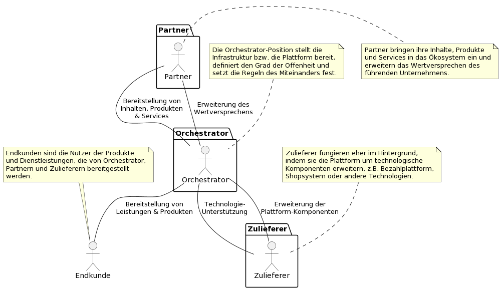
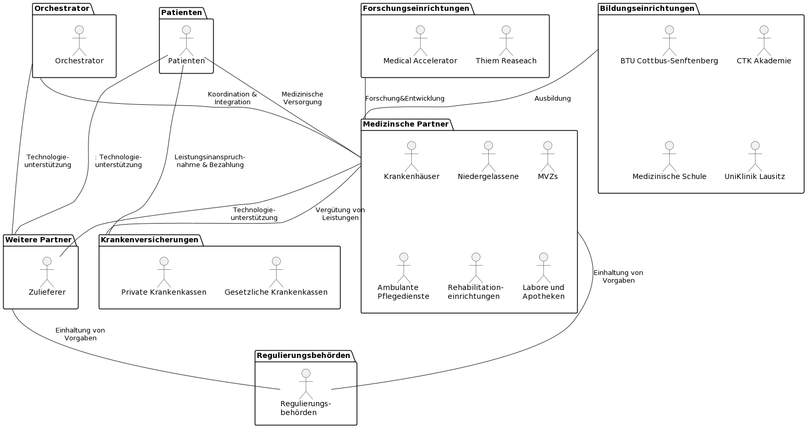

= Enterprise Architectures in einem großen deutschen Krankenhaus
:author: Philipp Michalke
:date: 2023-09-19

== Einleitung: Region Lausitz und Kohleausstieg
* Historischer Hintergrund der Lausitz
* Bedeutung des Kohleausstiegs für die Region

== Der Gesundheitssektor und Krankenhäuser im BIP-Vergleich Deutschland
* Größe und Bedeutung des Gesundheitssektors
* Anteil der Krankenhäuser am Bruttoinlandsprodukt

| Jahr | Gesundheitsausgaben (% BIP) | Krankenhausausgaben (% BIP) | Automobilbranche (% BIP) |
|------|-----------------------------|-----------------------------|--------------------------|
| 2019 | 11,93% (414,49 Mrd. €)      | 2,98% (103,42 Mrd. €)       | 4,50% (156,33 Mrd. €)    |
| 2020 | 12,96% (441,03 Mrd. €)      | 3,36% (114,30 Mrd. €)       | 4,50% (153,17 Mrd. €)    |
| 2021 | 13,10% (474,13 Mrd. €)      | 3,17% (114,83 Mrd. €)       | 4,50% (162,79 Mrd. €)    |

https://www.destatis.de/DE/Themen/Gesellschaft-Umwelt/Gesundheit/Gesundheitsausgaben/Tabellen/einrichtungen.html

== Strategie Gesundheitsregion Lausitz und Uni Klinik Cottbus
* Gründung einer eigenen Universität für Medizinstudium in Cottbus
  ** Nicht unter dem Dach der BTU Cottbus-Senftenberg
  ** Als Teil des Lausitzer Strukturwandels
  ** Investition von rund 2,1 Milliarden Euro bis 2038 durch Bund und Land
* Schwerpunkte der Forschung
  ** Gesundheitssystemforschung
  ** Digitalisierung des Gesundheitswesens
* Carl-Thiem-Klinikum (CTK) Cottbus
  ** Ausbau zum Universitätsklinikum
  ** Entwicklung zum "Digitalen Leitkrankenhaus"
* Einzigartigkeit des Projekts
  ** 37. staatliche Unimedizin in Deutschland
  ** Fokus auf 'Gesundheitssystemforschung' und 'Digitalisierung des Gesundheitswesens'
* Zeitplan
  ** Konzeptprüfung durch den Wissenschaftsrat Ende März
  ** Erwartetes Ergebnis im Frühjahr 2024
  ** Gründung der Medizinischen Universität Mitte 2024
  ** Start der ersten Studierenden 2026
  ** Vollausbau der Unimedizin bis 2035
  ** 1.300 Arbeitsplätze in Forschung und Lehre
  ** 200 Studienanfänger pro Jahr geplant
  ** Erste Lausitzer Ärzte verlassen die Uni 2032
* Historischer Hintergrund
  ** Erste Diskussionen über Medizinstudium in Cottbus 2019
  ** Ursprünglicher Plan: Start des Studiums im Semester 2023/2024
  ** Vorschlag 2021: Gründung einer Medizinischen Fakultät an der BTU Cottbus-Senftenberg
  ** Entscheidung 2023: Gründung einer eigenen Universität für Medizinstudium
* Reaktionen und Partnerschaften
  ** Kritik von BTU-Präsidentin Gesine Grande
  ** Betonung der Notwendigkeit der Zusammenarbeit zwischen der neuen Medizinuniversität und der BTU
  ** Geplante enge Kooperationen zwischen beiden Universitäten

== Das Umfeld Krankenhaus für EAM
* Herausforderungen und Besonderheiten des Krankenhausumfelds
  ** Einzigartigkeit des Geschäftsmodells von Krankenhäusern
  ** Hohe Komplexität pro Mitarbeiter im Vergleich zu anderen Branchen

* Carl-Thiem Klinikum (CTK) Geschäftsmodell
  ** Cashflow wird über Diagnosis Related Groups (DRG) definiert
  ** Es gibt 1300 unterschiedliche abrechenbare Behandlungen (DRGs)
  *** Beispiele für DRGs:
      *** Geburt eines Kindes
      *** Diagnose eines Herzinfarkts
      *** Operation zur Einsetzung einer Kniegelenkprothese
  ** Im Jahr 2021:
      *** Die CTK-Gruppe führte etwa 1000 von den 1300 möglichen Behandlungen durch
      *** Die Behandlungen waren fast gleichmäßig auf die Hauptgruppen verteilt
      *** Das "Customer Facing Service-Portfolio" bestand aus rund 1000 spezialisierten Dienstleistungen

* Komplexität der Arbeit: DRGs und Mitarbeitervergleich
  ** Die Vielfalt und Spezialisierung der Dienstleistungen im Krankenhausumfeld
  ** Notwendigkeit einer effizienten und genauen Abrechnung für jede einzelne Behandlung

== EAM Methoden: Capability Model & Domänenlandkarte
* Sicherstellung der EAM-Hygiene
  ** Wichtigkeit der allgemeinen Konsistenz im Enterprise Architecture Management
  ** Verwendung von Business Capability Models zur Validierung von Domänen
  *** Etwa 300 Capabilities im Business Capability Model
  *** Methoden zur Erstellung: Befragungen, Datenanalyse und Best Practices

* Definition und Bedeutung des Capability Models
  ** Definition der wichtigsten Geschäftsfähigkeiten
  ** Etwa 500 Anwendungen im Modell
  ** Herleitung von Architecture Domain Models
  *** Beachtung von Conways Law: Organisationsstrukturen beeinflussen die entworfenen Systeme
  *** Identifizierung der wichtigsten Anwendungscluster durch Befragungen, Datenanalyse und Best Practices

* Erstellung und Nutzung der Domänenlandkarte
  ** Systematisches Quality Requirements Engineering
  ** Herausforderungen durch Legacy-Systeme
  *** Das Krankenhaus ist 100 Jahre alt, was bedeutet, dass es eine Technologiegeschichte von 100 Jahren in der Organisation gibt
  *** Notwendigkeit, alte Technologien und Systeme zu berücksichtigen und zu integrieren

* Review
  ** Überprüfung und Anpassung der erstellten Modelle und Landkarten
  ** Ständige Aktualisierung und Anpassung an sich ändernde Geschäftsanforderungen und Technologietrends

== EAM Methoden: Systemarchäologie
* Herausforderungen von Legacy-Architekturen
  ** Notwendigkeit, alte Systeme und Technologien zu verstehen und zu integrieren
  ** Schwierigkeiten bei der Aktualisierung und Anpassung an moderne Technologiestandards

* EAM-Hygiene im Kontext der Systemarchäologie
  ** Systematische Vorgehensweise zur Erstellung eines klaren Bildes von Legacy-Architekturen
  ** Validierung strukturierter Daten zur genauen Abbildung der bestehenden Systemlandschaft

* Kollaborative Ansätze zur Aufarbeitung von Legacy-Architekturen
  ** Entwicklung kollaborativer Methoden zur Integration von Dokumentation und Strukturdaten
  ** Einbeziehung verschiedener Stakeholder und Experten zur gemeinsamen Aufarbeitung und Dokumentation
  ** Ziel: Ein konsistentes und aktuelles Bild der gesamten Systemlandschaft zu erhalten

== Koordination mit Program Portfolio Management
* Scoping von Projekten: Iterative Ansätze
  ** Greenfield-Ansätze sind nicht umsetzbar
  *** Begrenzte Kapazitäten im Fachbereich, insbesondere beim medizinischen Personal
  *** Notwendigkeit für kontinuierlichen Betrieb ohne Unterbrechungen
  *** Vermeidung von Big-Bang-Migrationen aufgrund der kritischen Natur des Geschäftsbetriebs
  ** Viele kleine, schrittweise Veränderungen sind bevorzugt, um Risiken zu minimieren und den Betrieb aufrechtzuerhalten

* Bedeutung für die EAM
  ** EAM-Umsetzung dient zur Unterstützung des Projektportfolio-Managements
  *** Überprüfung von Architekturänderungen
  *** Sicherstellung, dass das Projektportfolio MECE ist (Mutually Exclusive, Collectively Exhaustive)
  ** Zusammenarbeit mit dem Projekt Portfolio Management
  *** Arbeiten im Einklang mit den Zielen und Prioritäten des Projektportfolios
  *** Harmonisierung von Projekt-Scopes sukzessive, um Konsistenz und Effizienz zu gewährleisten

== EAM-Strategie: Prinzipienbasiertes Arbeiten Sourcing
* Definition und Vorteile des prinzipienbasierten Arbeitens
  ** Ein Ansatz, der auf festgelegten Prinzipien basiert, um Entscheidungen zu treffen und Aktionen zu leiten
  ** Fördert Konsistenz, Transparenz und Nachvollziehbarkeit in Entscheidungsprozessen

* Entscheidungsbäume in Sourcing-Entscheidungen: Process follows Tool vs. Tool follows Process
  ** Process follows Tool: Anpassung von Prozessen an verfügbare Tools
  ** Tool follows Process: Auswahl oder Anpassung von Tools basierend auf bestehenden Prozessen

* Modellierung des EAM-Strategieprozesses
  ** Verwendung von ArchiMate zur Darstellung von Beziehungen und Abhängigkeiten
  ** Identifikation von Zielen, Einschränkungen, Handlungssträngen und Lieferergebnissen

image::eam-strategy-pattern/strategy-execution-archimate.png[]

== EAM-Strategie: Business Ökosystem Analyse
* Bedeutung der Business Ökosystem Analyse für die IT-Strategie
  ** Die Analyse des Business-Ökosystems ermöglicht es Unternehmen, ihre Position im Markt zu verstehen und wie sie mit anderen Akteuren interagieren.
  ** Es hilft bei der Identifizierung von Chancen und Risiken, die sich aus der Interaktion mit anderen Akteuren ergeben.
  ** Die IT-Strategie kann dann darauf ausgerichtet werden, um die Vorteile des Ökosystems zu maximieren und die Risiken zu minimieren.

* Modellierung des Business-Ökosystems
  ** Verwendung von UML zur Darstellung von Beziehungen und Abhängigkeiten zwischen verschiedenen Akteuren im Ökosystem.

* Aufbau von Fähigkeiten und Partnernetzwerken in der regionalen Branche
  ** Die Entwicklung von Fähigkeiten und der Aufbau von Partnernetzwerken sind entscheidend für den Erfolg in der regionalen Branche.
  ** Durch die Zusammenarbeit mit Partnern können Unternehmen ihre Ressourcen und Fähigkeiten bündeln, um gemeinsame Ziele zu erreichen.

