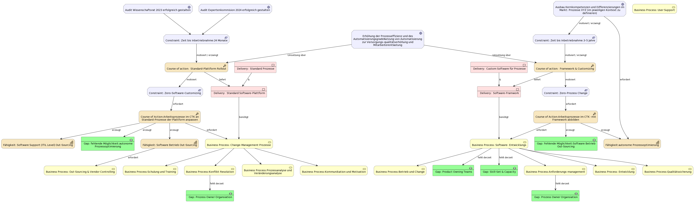

= Enterprise Architectures in einem großen deutschen Krankenhaus
:author: Philipp Michalke
:date: 2023-09-19

== Einleitung: Region Lausitz und Kohleausstieg
* Historischer Hintergrund der Lausitz
* Bedeutung des Kohleausstiegs für die Region

== Der Gesundheitssektor und Krankenhäuser im BIP-Vergleich Deutschland
* Größe und Bedeutung des Gesundheitssektors
* Anteil der Krankenhäuser am Bruttoinlandsprodukt

== Strategie Gesundheitsregion Lausitz und Uni Klinik Cottbus
* Vision und Ziele der Gesundheitsregion
* Rolle der Uni Klinik Cottbus im regionalen Gesundheitsnetzwerk
* Digitalisierung und Leitkrankenhaus-Konzept
** Link: https://www.rbb24.de/studiocottbus/politik/2023/03/brandenburg-cottbus-universitaet-medizin-ausbildung-kabinett-konzept.html

== Das Umfeld Krankenhaus für EAM
* Herausforderungen und Besonderheiten des Krankenhausumfelds
* Komplexität der Arbeit: DRGs und Mitarbeitervergleich

== EAM Methoden: Capability Model & Domänenlandkarte
* Definition und Bedeutung des Capability Models
* Erstellung und Nutzung der Domänenlandkarte

== EAM Methoden: Systemarchäologie
* Herausforderungen von Legacy-Architekturen
* Kollaborative Ansätze zur Aufarbeitung

== Koordination mit Program Portfolio Management
* Scoping von Projekten: Iterative vs. Greenfield-Ansätze
* Bedeutung für die EAM

== EAM-Strategie: Prinzipienbasiertes Arbeiten
* Definition und Vorteile des prinzipienbasierten Arbeitens
* Entscheidungsbäume in Sourcing-Entscheidungen: Process follows Tool vs. Tool follows Process

== EAM-Strategie: Business Ökosystem Analyse
* Bedeutung der Business Ökosystem Analyse für die IT-Strategie
* Aufbau von Fähigkeiten und Partnernetzwerken in der regionalen Branche
